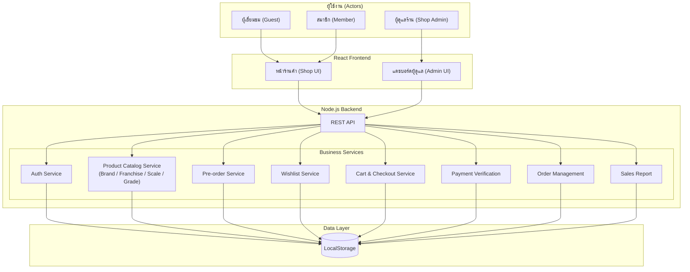

# ModelFigure Shop: ร้านค้าออนไลน์สำหรับจัดจำหน่ายโมเดลและฟิกเกอร์

Git Page https://itsiwa.github.io/model-and-figure-shop/

## 1) ข้อมูลกลุ่ม (Group information)
- **ชื่อกลุ่ม:** Model-Figure
- **จำนวนสมาชิก:** 5/5
- **1.67096842 กชกร ฉวีกุลมหันต์** — Project Manager
- **2.67095943 ภาณุวิชญ์ ปิ่นทอง** — Frontend
- **3.67109344 อิฐศิวะ ต่อเหล่าทรัพย์** — Frontend & Backend
- **4.67109337 อนุวัฒน์ สีสันติ** — Frontend & Backend
- **5.67109320 ธีรเดช ม้าจีน** — Backend API

## 2) ชื่อโครงงาน (Project Title)
- **ชื่อโครงงาน (ภาษาไทย):** ร้านขายโมเดลและฟิกเกอร์ออนไลน์ (ModelFigure Shop)
- **ชื่อโครงงาน (ภาษาอังกฤษ):** ModelFigure Shop

## 3) หลักการและเหตุผล (Rationale)
ตลาดโมเดลและฟิกเกอร์ในปัจจุบันมีการเติบโตอย่างต่อเนื่อง โดยเฉพาะในกลุ่มแฟนอนิเมะ มังงะ และผู้ที่ชื่นชอบการสะสมของสะสม อย่างไรก็ตาม ผู้ซื้อยังประสบปัญหาในการค้นหาสินค้าที่ต้องการ เนื่องจากร้านค้าออนไลน์ที่มีอยู่ขาดการจัดหมวดหมู่สินค้าที่ชัดเจนและระบบค้นหาที่มีประสิทธิภาพ ทางคณะผู้จัดทำจึงได้พัฒนาแพลตฟอร์ม **"ModelFigure Shop"** ขึ้นมา เพื่อเป็นร้านค้าออนไลน์ที่รวบรวมโมเดลและฟิกเกอร์หลากหลายประเภท ช่วยให้ผู้ซื้อสามารถค้นหา เปรียบเทียบ และสั่งซื้อสินค้าได้อย่างสะดวกรวดเร็ว

## 4) วัตถุประสงค์ของโครงงาน
1. พัฒนาแพลตฟอร์ม e-Commerce สำหรับซื้อขายโมเดลและฟิกเกอร์ที่มีประสิทธิภาพและใช้งานง่าย
2. เพื่ออำนวยความสะดวกให้ผู้ใช้งานสามารถค้นหา เลือกดูข้อมูลสินค้า และสั่งซื้อได้ครบจบในที่เดียว
3. เพื่อประยุกต์ใช้ความรู้ด้านดิจิทัลแพลตฟอร์มและการพัฒนาซอฟต์แวร์ตามกระบวนการ SDLC

## 5) ขอบเขตของระบบ (System Scope)

### ผู้เยี่ยมชม (Guest)
- เรียกดูสินค้าและค้นหาตามหมวดหมู่ (กันดั้ม, ฟิกเกอร์อนิเมะ, สเกลโมเดล, อุปกรณ์เสริม) โดยไม่ต้องสมัครสมาชิก
- กรองสินค้าตามแบรนด์ (Bandai, Good Smile Company, Kotobukiya), ช่วงราคา, เกรด (HG / MG / PG) และสเกล (1/144, 1/100, 1/60)
- ดูรายละเอียดสินค้า รูปภาพ สเปค และวันวางจำหน่าย

### สมาชิก (Member)
- สมัครสมาชิกและเข้าสู่ระบบ (Register / Login)
- เพิ่มสินค้าลง Wishlist เพื่อติดตามสินค้าที่สนใจและรับแจ้งเตือนเมื่อสินค้าพร้อมจำหน่าย
- จอง Pre-order สินค้าที่ยังไม่วางจำหน่าย พร้อมยืนยันจำนวนและชำระมัดจำ
- จัดการตะกร้าสินค้าและสั่งซื้อพร้อมอัปโหลดสลิปการชำระเงิน
- ติดตามสถานะคำสั่งซื้อ (รอยืนยัน → ชำระเงินแล้ว → กำลังจัดส่ง → ได้รับสินค้า) และดูประวัติการสั่งซื้อ
- จัดการข้อมูลส่วนตัวและที่อยู่จัดส่งหลายที่อยู่

### ผู้ดูแลร้าน (Shop Admin)
- จัดการข้อมูลสินค้าพร้อม attribute เฉพาะฟิกเกอร์ (แฟรนไชส์, แบรนด์, สเกล, เกรด, วันวางจำหน่าย, ราคา, จำนวนสต็อก)
- จัดการระบบ Pre-order: กำหนดช่วงเวลาจอง, โควตา, ราคามัดจำ และวันปิดรับจอง
- ตรวจสอบสลิปการชำระเงินและอัปเดตสถานะคำสั่งซื้อ
- ดูรายงานยอดขายจำแนกตามหมวดหมู่สินค้า แฟรนไชส์ และช่วงเวลา
- จัดการบัญชีสมาชิก (ดู / ระงับ / ลบ)

## 6) แนวทางการพัฒนาตาม SDLC (Brief Description)
| ขั้นตอน (Phase) | รายละเอียดโดยย่อ (Brief Description) |
|---|---|
| 1. Planning | ประชุมวางแผน กำหนดหัวข้อโครงงาน "ModelFigure Shop" และจัดทำเอกสารขออนุมัติ |
| 2. Analysis | รวบรวม Requirements กำหนดขอบเขตการทำงานของ User แต่ละกลุ่ม |
| 3. Design | ออกแบบ ER-Diagram, System Architecture Diagram และ UI Wireframe บน Figma |
| 4. Development | พัฒนา Frontend (React) และ Backend (Node.js) พร้อมเชื่อมต่อ LocalStorage |
| 5. Testing | ทดสอบระบบแบบ Manual Testing ตาม Test Cases เพื่อค้นหาและแก้ไข Bug |
| 6. Deployment | นำระบบขึ้น GitHub Pages เพื่อให้ผู้สอนและผู้เกี่ยวข้องเข้าใช้งานได้ |
| 7. Maintenance | ตรวจทานระบบหลังติดตั้ง รับ Feedback และสรุปผลโครงงาน |

## 7) เครื่องมือและเทคโนโลยีที่ใช้
- **Frontend:** React
- **Backend:** Node.js
- **Database:** LocalStorage

## 8) ประเภทการทดสอบ (Test Types)
- User Acceptance Testing (UAT)
- **เครื่องมือที่ใช้ (Tools)**
- Manual Testing

## 9) ผลลัพธ์ที่คาดว่าจะได้รับ
1. ได้แพลตฟอร์มร้านค้าออนไลน์ ModelFigure Shop ที่สามารถซื้อขายโมเดลและฟิกเกอร์ได้จริงตามขอบเขตที่กำหนด
2. ผู้ใช้งานได้รับความสะดวกในการค้นหาและเลือกซื้อโมเดลและฟิกเกอร์ที่ต้องการ
3. ผู้จัดทำเข้าใจกระบวนการพัฒนาซอฟต์แวร์ตามหลัก SDLC และสามารถทำงานร่วมกันเป็นทีมอย่างมีประสิทธิภาพ

## 10) แผนการดำเนินงาน 4 สัปดาห์ (Work Plan)
| สัปดาห์ | รายละเอียดโดยย่อ |
|---|---|
| สัปดาห์ที่ 1 (วิเคราะห์และออกแบบระบบ) | ประชุมเก็บความต้องการ ออกแบบ Use Case, Database และสร้าง UI Prototype บน Figma |
| สัปดาห์ที่ 2 (พัฒนา Frontend) | พัฒนาหน้าจอ Interface ทั้งหมด (หน้าแรก, หน้ารายละเอียดสินค้า, ตะกร้าสินค้า, หน้า Admin) |
| สัปดาห์ที่ 3 (พัฒนา Backend และฐานข้อมูล) | พัฒนาระบบ API, ระบบ Login, จัดการสินค้าและคำสั่งซื้อ เชื่อมต่อ Frontend กับ Backend |
| สัปดาห์ที่ 4 (ทดสอบและนำเสนอ) | ทดสอบระบบแบบ Manual แก้ไขจุดบกพร่อง และนำเสนอผลงาน |

## Diagram

